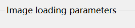
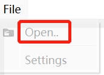
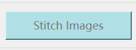
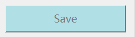
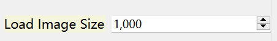
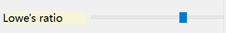
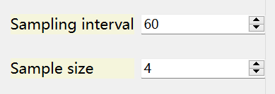

# ComputerVision_CW

[Welcome](https://moodle.nottingham.ac.uk/login/index.php)

Following the instructions to launch QT GUI for generating panorama from videos.

The file size of all test videos is around 100M, so a link is provided for downloading

check: [Test clips](https://drive.google.com/file/d/1jK4H_lxSZ69t4TE1AyW6gVcV6FwTN3Kg/view?usp=sharing)

## Install and usage
 
Turn on command line in project folder

```
cd src
```

Install the requirements    

```
pip install -r requirements.txt
```
  
Run the python file:

```
python main.py
```
All running processes will be recorded in "*_output.log" file

## You are now able to see the app's GUI

Setting base parameter befor import the video in the right tool box



- Notice: The Sampling realted parameters should be set before loading the video

Import the video file into the APP



- Notice: Current version only support .mp4 file with resolution higher than 800*600

After seeing the images and loaded file path present on the screen, click Stitch to start



The complete result would be displayed in the left scene

Click save button would save current result into 'result' folder



## Key settings

When processing, this parameter would consider whehter re-scale the size of the images



This slider can change the sufficient variance used in match determinant



The interval based on frame rate: Sampling after how many frames interval



Whether auto crop the result and the degree of cropping [Testing feature]


